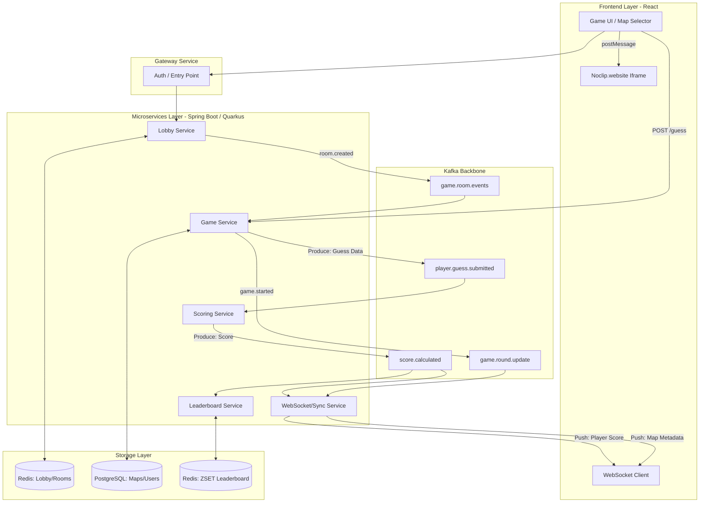
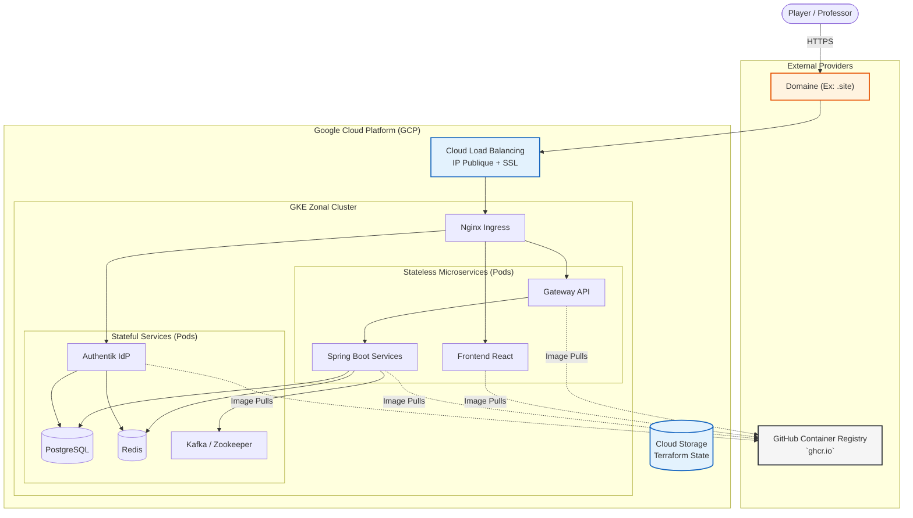

# game-guessr

GameGuessr is a multiplayer **"GeoGuessr for Video Games"**. Players explore iconic, accurately recreated 3D levels from classic video games (powered by `noclip.website`) and must use their game knowledge and spatial awareness to pinpoint their exact location on the map. 

The project features a **scalable microservices architecture**, real-time multiplayer synchronization, event-driven scoring, and a modern DevOps pipeline. It is designed to be highly competitive, lightweight, and engaging.

---

## Group Members
- Marie-Lou Allain (`marie-lou.allain`)
- Naïm Chefirat (`naim.chefirat`)
- Michaël Rousseau (`michael.rousseau`)
- Robin Vidal (`robin.vidal`)

---

## Tech Stack
- **Frontend**: React, WebGL (via `noclip.website` Iframe Bridge)
- **Backend**: Java / Spring Boot / Quarkus (Microservices)
- **Data & Real-Time**: PostgreSQL, Redis, Apache Kafka, WebSockets
- **Infrastructure**: Kubernetes (GKE Autopilot), Terraform, Helm, Docker
- **Security**: OAuth2 via Authentik

---

## Architecture Overview

The system is broken down into loosely coupled microservices communicating via REST APIs (synchronous) and Kafka Topics (asynchronous).

---

## Cloud Architecture
The infrastructure has been specifically designed to ensure high availability during the final academic defense while remaining strictly under a **300€/month budget**. 

To achieve this, managed database services were discarded in favor of self-hosted solutions within a single Google Kubernetes Engine (GKE) cluster, and GitHub Container Registry (`ghcr.io`) is used instead of GCP Artifact Registry.

### Justification of Technological Choices
1. **GitHub Container Registry (`ghcr.io`)**: Used to store our Docker images for free via GitHub Actions, saving the cost of GCP Artifact Registry.
2. **GKE Zonal Cluster**: We deploy a single zonal cluster to benefit from the free-tier management fee and use standard (or Autopilot with strict limits) nodes. 
3. **Stateful Pods over Managed Services**: Deploying PostgreSQL, Redis, and Kafka as Pods with Persistent Volumes directly in GKE avoids the massive costs associated with Cloud SQL and Memorystore, which are over-engineered for a project with limited traffic.
4. **Cloud Storage**: A simple bucket costing pennies per month to securely share the Terraform deploy state (`.tfstate`).

---

## Services & Microservices
| **Service** | **Stack** | **Responsibility** |
| --- | --- | --- |
| **Lobby Service** | Spring Boot + Redis | Manages active game rooms, presence, and host settings. |
| **Game Service** | Quarkus + PostgreSQL | Manages the match lifecycle, current round data, and validates coordinates. |
| **Scoring Service** | Spring Boot + Kafka | Stateless worker calculating Euclidean distances and assigning points. |
| **WebSocket / Sync** | Spring Boot + Redis | Bridges backend state changes (Kafka/Redis) directly to React clients. |
| **Leaderboard Service** | Spring Boot + Redis | Maintains real-time room rankings using Redis Sorted Sets (`ZSET`). |
| **Gateway Service** | Spring Cloud Gateway | Acts as the main router and entry point for all API calls. |
| **Auth Service** | Spring Boot + PostgreSQL| Manages users, JWT tokens, and OAuth integration (via Authentik). |
| **Frontend Service** | React | Runs `<iframe src="noclip.website">` alongside custom React UI logic. |

---

## Documentation
For detailed information on the design decisions, user stories, and architecture:
- [Conception & Architecture Document (MVP Scope)](docs/conception.md)
- [Sprint Planning & Roadmap](docs/sprint-planning.md)
- [Architecture Decision Records (ADRs)](docs/adr/)
- [Feature Epics & User Stories](docs/epics/)
