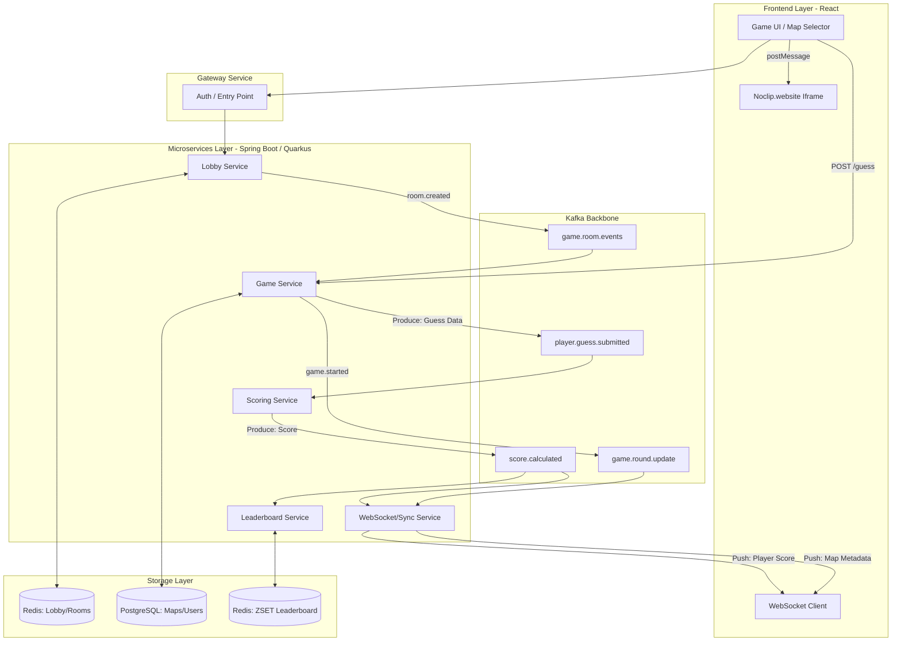

# GameGuessr

A multiplayer GeoGuessr-style game built around [noclip.website](https://noclip.website) — players explore 3D game levels and guess which game/level they're in.

## Architecture

4 Spring Boot microservices communicating over Kafka, backed by PostgreSQL and Redis.

```
Lobby Service  (8083) — Redis       → room/player management
Game Service   (8082) — PostgreSQL  → match lifecycle, round state, guess intake
Scoring Service(8084) — PostgreSQL  → consumes guesses, calculates & persists scores
Leaderboard    (8085) — Redis ZSET  → real-time rankings per room and globally
```

**Kafka pipeline:**
```
POST /guess → game-service → player.guess.submitted → scoring-service → score.calculated → leaderboard-service
                                                                      ↓
                                                          game.round.update → WebSocket (planned)
```

## Running locally

**Prerequisites:** Docker Desktop with at least 4 GB RAM allocated to the VM.

```bash
# Start infrastructure + all services
docker compose --profile app up -d

# Wait ~30s for services to start, then verify
curl http://localhost:8083/actuator/health  # lobby
curl http://localhost:8082/actuator/health  # game
curl http://localhost:8084/actuator/health  # scoring
curl http://localhost:8085/actuator/health  # leaderboard
```

Swagger UIs:
- Lobby: http://localhost:8083/swagger-ui.html
- Game: http://localhost:8082/swagger-ui.html
- Scoring: http://localhost:8084/swagger-ui.html
- Leaderboard: http://localhost:8085/swagger-ui.html

## API reference

### Lobby Service — `/api/v1/rooms`

| Method | Endpoint | Description |
|--------|----------|-------------|
| POST | `/api/v1/rooms` | Create room. Body: `{"hostId":"...", "isPrivate": false}` |
| GET | `/api/v1/rooms` | List all open rooms |
| GET | `/api/v1/rooms/{code}` | Get room details (players, settings, status) |
| PATCH | `/api/v1/rooms/{code}/settings` | Update round count / time limit / game pack (host only) |
| POST | `/api/v1/rooms/{code}/join` | Join a room |
| DELETE | `/api/v1/rooms/{code}/leave` | Leave a room (host leave → room CLOSED) |

Room status lifecycle: `OPEN → FULL → IN_PROGRESS → CLOSED`

### Game Service — `/api/v1/rooms`

| Method | Endpoint | Description |
|--------|----------|-------------|
| POST | `/api/v1/rooms/{code}/start` | Start match, generates 5 round locations |
| GET | `/api/v1/rooms/{code}/round` | Current round info (game ID + phase, coords hidden) |
| POST | `/api/v1/rooms/{code}/guess` | Submit a guess (publishes to Kafka) |
| GET | `/api/v1/rooms/{code}/results` | Full match results with true spawn coordinates |

Guess phases: `GAME` (identify the game title) · `LEVEL` (identify the map)

### Scoring Service — `/api/v1/scoring`

| Method | Endpoint | Description |
|--------|----------|-------------|
| GET | `/api/v1/scoring/{code}` | All scores for a match |
| GET | `/api/v1/scoring/{code}/rounds/{n}` | Scores for a specific round |

Scoring logic: GAME phase — binary 1000 pts / 0 pts. LEVEL phase — time-based bonus.

### Leaderboard Service — `/api/v1/leaderboard`

| Method | Endpoint | Description |
|--------|----------|-------------|
| GET | `/api/v1/leaderboard/global` | Top players across all games |
| GET | `/api/v1/leaderboard/global?top=N` | Top N players globally |
| GET | `/api/v1/leaderboard/room/{code}` | Rankings for a specific room |

## End-to-end tests

```bash
bash test-e2e.sh
```

Runs 76 assertions covering the full game loop: room CRUD, join/leave/capacity rules, match start, guess submission, Kafka scoring pipeline, leaderboard ranking, and error codes (400/403/404/409).

## Notes

- PostgreSQL is exposed on **port 5433** (not 5432) to avoid conflicts with local installs.
- The `scoringdb` database is auto-created at startup via `docker/init-scoringdb.sh`.
- The Kafka topic `score.calculated` has 3 partitions; leaderboard consumer uses group protocol and is assigned all partitions automatically.
# game-guessr

GameGuessr is a multiplayer **"GeoGuessr for Video Games"**. Players explore iconic, accurately recreated 3D levels from classic video games (powered by `noclip.website`) and must use their game knowledge and spatial awareness to pinpoint their exact location on the map. 

The project features a **scalable microservices architecture**, real-time multiplayer synchronization, event-driven scoring, and a modern DevOps pipeline. It is designed to be highly competitive, lightweight, and engaging.

---

## Group Members
- Marie-Lou Allain (`marie-lou.allain`)
- Naïm Chefirat (`naim.chefirat`)
- Michaël Rousseau (`michael.rousseau`)
- Robin Vidal (`robin.vidal`)

---

## Tech Stack
- **Frontend**: React, WebGL (via `noclip.website` Iframe Bridge)
- **Backend**: Java / Spring Boot / Quarkus (Microservices)
- **Data & Real-Time**: PostgreSQL, Redis, Apache Kafka, WebSockets
- **Infrastructure**: Kubernetes (GKE Autopilot), Terraform, Helm, Docker
- **Security**: OAuth2 via Authentik

---

## Architecture Overview

The system is broken down into loosely coupled microservices communicating via REST APIs (synchronous) and Kafka Topics (asynchronous).



---

## Services & Microservices
| **Service** | **Stack** | **Responsibility** |
| --- | --- | --- |
| **Lobby Service** | Spring Boot + Redis | Manages active game rooms, presence, and host settings. |
| **Game Service** | Quarkus + PostgreSQL | Manages the match lifecycle, current round data, and validates coordinates. |
| **Scoring Service** | Spring Boot + Kafka | Stateless worker calculating Euclidean distances and assigning points. |
| **WebSocket / Sync** | Spring Boot + Redis | Bridges backend state changes (Kafka/Redis) directly to React clients. |
| **Leaderboard Service** | Spring Boot + Redis | Maintains real-time room rankings using Redis Sorted Sets (`ZSET`). |
| **Gateway Service** | Spring Cloud Gateway | Acts as the main router and entry point for all API calls. |
| **Auth Service** | Spring Boot + PostgreSQL| Manages users, JWT tokens, and OAuth integration (via Authentik). |
| **Frontend Service** | React | Runs `<iframe src="noclip.website">` alongside custom React UI logic. |

---

## Documentation
For detailed information on the design decisions, user stories, and architecture:
- [Conception & Architecture Document (MVP Scope)](docs/conception.md)
- [Sprint Planning & Roadmap](docs/sprint-planning.md)
- [Architecture Decision Records (ADRs)](docs/adr/)
- [Feature Epics & User Stories](docs/epics/)
