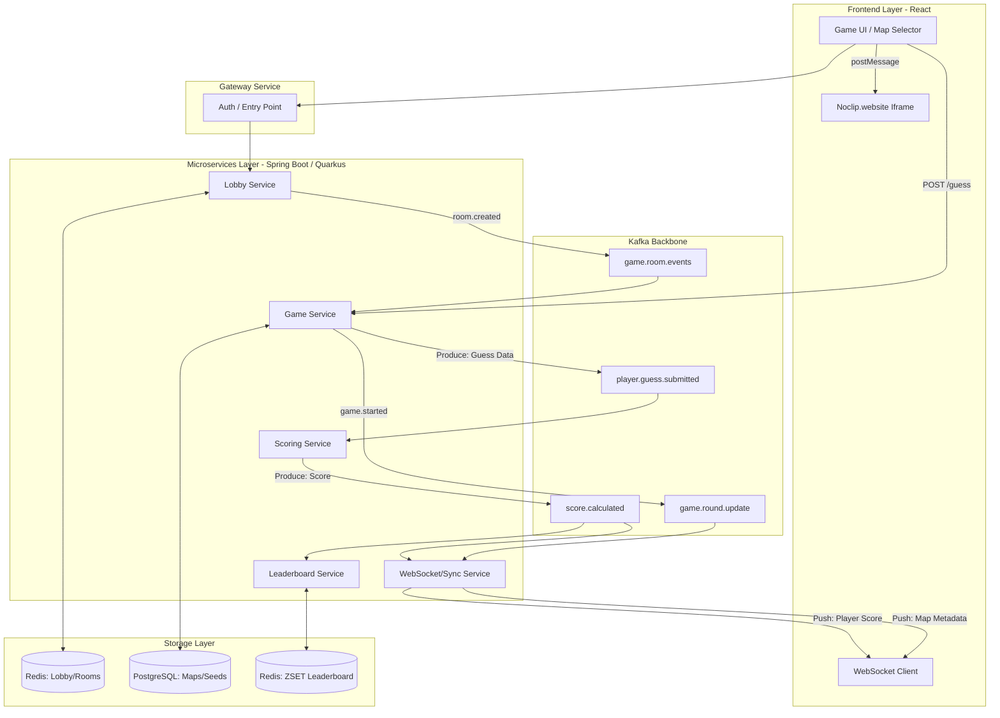

# Design Document: GameGuessr

## 1. Functional Vision

### 1. Introduction
**GameGuessr** is a digital exploration game that transforms technical "noclip" museum archives into an interactive, competitive experience. While projects like [noclip](https://noclip.website) provide incredible access to video game history by reverse-engineering level geometry, they are primarily passive experiences.

- **Objectives:** To gamify the exploration of classic 3D environments.
- **Needs Addressed:** Provides a centralized platform for speedrunners, enthusiasts, and casual gamers to test their knowledge of iconic game worlds.
- **Value Add:** By integrating a high-performance Java backend with a specialized 3D rendering frontend, we offer a low-latency, multiplayer environment that brings static game assets to life.

### 2. Business Model & Market Positioning
**GeoGuessr** has validated the "discovery-game" genre with millions of players, but it is limited to real-world data. **GameGuessr** disrupts this by applying that loop to **virtual geography**.

| **Feature** | **GeoGuessr** | **Lostgamer.io** | **GameGuessr** |
| --- | --- | --- | --- |
| **World** | Real World (Street View) | Static Game Maps | **Explorable 3D Levels** |
| **Freedom** | Fixed Path (Click-to-move) | 2D or Static 3D | **True Noclip (Full Fly)** |
| **Tech** | Google Maps API | Proprietary/Static | **Real-time WebGL Rendering** |
| **Cost** | High (Google API fees) | Low (Static assets) | **Scalable Kafka/Java Backend** |

### 3. User Profiles
We have identified multiple types of players and roles to support the ecosystem:

| Player types | Roles |
| --- | --- |
| **The Explorer (Casual Player)** | Wants to discover nostalgic environments without the pressure of a game's original difficulty |
| **The Competitive Gamer** | Focuses on pixel-perfect accuracy and fast guess times to climb the global leaderboard |
| **The Room Host** | A user who organizes private matches for friends, customizing game packs and round limits |
| **The Curator (Admin)** | A specialized user responsible for validating "Golden Seeds"—high-quality spawn points that ensure players don't spawn inside walls or in empty space |

### 4. Functional Specifications (The Game Loop)
The game loop is modeled after "GeoGuessr" mechanics but adapted for 3D coordinate-based environments.
- **Room Creation:** A Host initializes a session, selecting visibility (public/private) and game packs.
- **Dynamic Rounds:** A match consists of X rounds (configurable by the host).

Each round is divided into three progressive phases to reward both general knowledge and spatial precision:

| **Phase** | **Objective** | **Interaction** | **Scoring Logic** |
| --- | --- | --- | --- |
| **Phase 1: The Game** | Identify the title (e.g., *Super Mario 64*) | Search bar with autocompletion | Binary (Correct/Incorrect) |
| **Phase 2: The Map** | Identify the specific level | Locked until Phase 1 is solved; Autocomplete list | Time-based bonus |
| **Phase 3: The Spot (Post-MVP)** | Pinpoint exact `(x, y, z)` coords | 2D Top-down map or 3D "Drop Pin" | Euclidean Distance (`0–5000` pts) |

### MVP Scope & Discarded Features
#### Included in MVP
- OAuth login (Authentik + Epita provider) with persistent user profiles.
- Private rooms with invite links & Host role.
- 1 curated game pack (Mario Kart).
- 2-phase gameplay (Explore, Guess Game & Level).
- Real-time multiplayer synchronization (WebSocket & Redis).
- Leaderboard & Kafka-based scoring.
- Kubernetes deployment on Google Cloud Platform with GKE Autopilot, Helm & CI/CD pipeline.

#### Out of Scope (Post-MVP)
- **Phase 3: The Spot (Drop Pin/Coordinates guessing).**
- Multiple game packs & Room configuration by Host.
- Public rooms (auto-matchmaking, ELO, dedicated queues).
- Advanced anti-cheat, seasonal rankings, global leaderboards.
- Advanced metrics/dashboards (Prometheus/Grafana) and ArgoCD GitOps.
- Mobile device support.

### Backlog (MVP User Stories)
To maintain a concise design document, detailed user stories and acceptance criteria are separated into Epic documents inside the [`docs/epics/`](./epics/) directory:

- [EPIC A — Authentication & User Management](./epics/epic-a-authentication.md)
- [EPIC B — Room System](./epics/epic-b-room-system.md)
- [EPIC C — Core Gameplay Loop](./epics/epic-c-core-gameplay.md)
- [EPIC D — Real-Time Infrastructure](./epics/epic-d-real-time-infra.md)
- [EPIC E — DevOps & Infrastructure](./epics/epic-e-devops-infra.md)
- [EPIC F — Social & Ecosystem (Post-MVP)](./epics/epic-f-social.md)
- [EPIC G — Post-Release & Advanced Infra](./epics/epic-g-post-release.md)

---

## 2. Organization and Planning

### Sprint Planning
For a detailed breakdown of the MVP timeline, deliverables, and goals per sprint (Sprint 0 to Sprint 3), please refer to the Sprint Planning document:
- [Sprint Planning (MVP)](./sprint-planning.md)

---

## 3. Architecture and Technical Stack

### 3.1. Microservices Architecture
We have chosen a Java/Spring Boot stack using a hexagonal architecture for modularity, with Kafka ensuring resilience for handling concurrent guesses.

| **Service** | **Technology** | **Responsibility** |
| --- | --- | --- |
| **Lobby Service** | Spring Boot + Redis | Manages Rooms, Player joins/leaves, and Match configuration |
| **Game Service** | Spring Boot/Quarkus + PostgreSQL | Picks 5 random coordinates/maps; manages round timers |
| **Scoring Service** | Spring Boot | Consumes "Guesses" from Kafka, calculates scores, persists them |
| **Leaderboard Service** | Spring Boot + Redis | Maintains real-time rankings using Redis Sorted Sets (`ZSET`) |
| **Gateway Service** | Spring Cloud Gateway/Ingress | Acts as a router to redirect API calls |
| **Auth Service** | Spring Boot + PostgreSQL | Manages users, tokens, and OAuth accounts (via Authentik) |
| **Frontend Service** | React | Runs `<iframe src="noclip.website">` + all custom game UI logic |

### 3.2. Integration with Noclip.website (Iframe Bridge)
The main frontend application will host the Noclip site in an `<iframe>`. We communicate via the **Window.postMessage API**.
```javascript
iframeRef.contentWindow.postMessage({
    type: 'SET_MAP',
    mapId: 'mario-kart-8/BabyPark',
    coords: { x: 100, y: 50, z: -200 }
}, '*');
```

### 3.3. REST API Endpoints Overview

#### Lobby Service
| **Method** | **Endpoint** | **Description** |
| --- | --- | --- |
| **POST** | `/api/v1/rooms` | Create a new room. Returns a `roomCode`. |
| **GET** | `/api/v1/rooms/{code}` | Get room details (players, settings, status). |
| **PATCH** | `/api/v1/rooms/{code}/settings` | Update round count, time limit, or game pack. |
| **POST** | `/api/v1/rooms/{code}/join` | Add a player to the lobby. |
| **DELETE** | `/api/v1/rooms/{code}/leave` | Remove yourself from the lobby. |

#### Game Service
| **Method** | **Endpoint** | **Description** |
| --- | --- | --- |
| **POST** | `/api/v1/rooms/{code}/start` | Transitions state to `IN_PROGRESS`. Generates the 5 locations. |
| **GET** | `/api/v1/rooms/{code}/round` | Get current round info (game ID and map, but **not** coordinates). |
| **POST** | `/api/v1/rooms/{code}/guess` | **Producer:** Accepts (X, Y, Z) guess. Sends a message to Kafka. |
| **GET** | `/api/v1/rooms/{code}/results` | Returns final scores for all 5 rounds after the game ends. |

#### Leaderboard Service
| **Method** | **Endpoint** | **Description** |
| --- | --- | --- |
| **GET** | `/api/v1/leaderboard/global` | Get top players across all games. |
| **GET** | `/api/v1/leaderboard/room/{code}` | Get the current ranking within a specific room. |

### 3.4. Kafka Topics Backbone
| **Topic Name** | **Producer** | **Primary Consumer** | **Importance** |
| --- | --- | --- | --- |
| `game.room.events` | Lobby Service | Game Service | Low (Setup) |
| `player.guess.submitted` | Game Service | Scoring Service | **High (Gameplay)** |
| `score.calculated` | Scoring Service | Leaderboard Service | **High (Results)** |
| `game.round.update` | Game Service | WebSocket Service | Medium (Sync) |



#### Architecture Decision Records (ADR)
To accompany the software architecture, major technical decisions (e.g., using Kafka vs REST for scoring, **1 vs 2 Kubernetes clusters**) will be documented as Architecture Decision Records (ADR) in the [`docs/adr/`](./adr/) directory.

### 4. DevOps Platform

- **Code Management**: Git monorepo (`/frontend`, `/services/*`, `/helm`, `/infra`).
- **Packaging Strategy**: Docker containerization for each microservice.
- **CI/CD Pipeline**: 
  - Pull Requests trigger Docker image builds, linting, formatting, and unit tests (targeting only the changed sub-repositories).
  - Merges to `main` push the image to a registry and trigger a manual or automated Helm deployment.
- **Infrastructure**: **Single Kubernetes cluster** (GKE Autopilot) provisioned via **Terraform** (IaC) containing multiple namespaces (e.g., `gameguessr-dev` and `gameguessr-prod`). Helm is used to deploy charts, ConfigMaps, and Secrets. GitOps (ArgoCD) is excluded for the MVP but planned for Post-Release.
